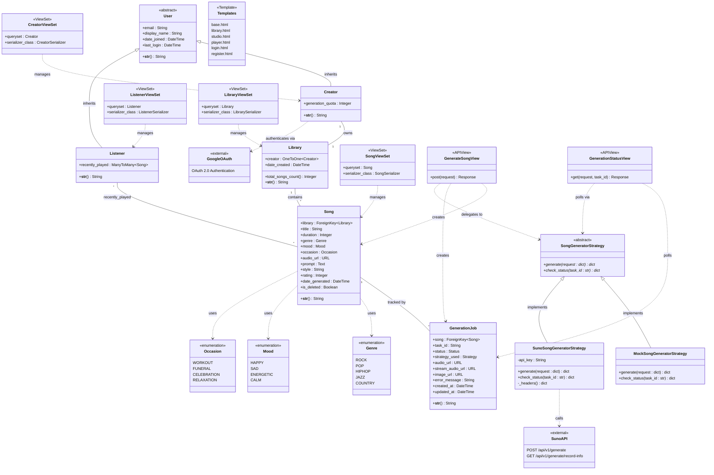

# Updated Class Diagram — Cithara AI Music Generation Platform

## Changelog
- **v1.2 (Updated)**:
  - Added `prompt`, `style`, `rating` attributes to `Song` class for FR-16 (Rating) and UC-08 (Regenerate)
- **v1.1 (Updated)**:
  - Added `audio_url` and `is_deleted` attributes to `Song`
  - Added `GenerationJob` class
  - Added Strategy pattern classes (`SongGeneratorStrategy`, `MockSongGeneratorStrategy`, `SunoSongGeneratorStrategy`)
  - Added Serializer classes to show full MVT architecture

---

## Class Diagram (Mermaid)

## Architecture Summary (MVT)

| Layer | Components | Files |
|---|---|---|
| **Model** | `User`, `Creator`, `Listener`, `Library`, `Song`, `GenerationJob`, `Genre`, `Mood`, `Occasion` | `domain/models/*.py` |
| **View** | `CreatorViewSet`, `ListenerViewSet`, `LibraryViewSet`, `SongViewSet`, `GenerateSongView`, `GenerationStatusView` + frontend views | `domain/views/*.py` |
| **Template** | `base.html`, `library.html`, `studio.html`, `player.html`, `login.html`, `register.html` | `domain/templates/domain/*.html` |
| **Strategy** | `SongGeneratorStrategy` (ABC), `MockSongGeneratorStrategy`, `SunoSongGeneratorStrategy` | `domain/generation/*.py` |
| **Serializer** | `CreatorSerializer`, `ListenerSerializer`, `LibrarySerializer`, `SongSerializer`, `GenerationRequestSerializer`, `GenerationJobSerializer` | `domain/serializers/*.py` |

## What Changed from v1.0

### Song class — new attributes:
- `audio_url`: URL — stores the link to the generated audio file
- `is_deleted`: Boolean — implements the soft-deletion pattern described in the original domain model assumptions

### GenerationJob — entirely new class:
- Tracks async song-generation tasks
- Links to Song via ForeignKey
- Records which strategy was used (Mock vs Suno)
- Stores intermediate status updates (PENDING → TEXT_SUCCESS → FIRST_SUCCESS → SUCCESS)

### Strategy Pattern — new class hierarchy:
- `SongGeneratorStrategy` (abstract base class)
- `MockSongGeneratorStrategy` (offline, deterministic generation for development)
- `SunoSongGeneratorStrategy` (real AI generation via Suno API)
- Selected at runtime via `get_generator()` factory function and `GENERATOR_STRATEGY` setting
