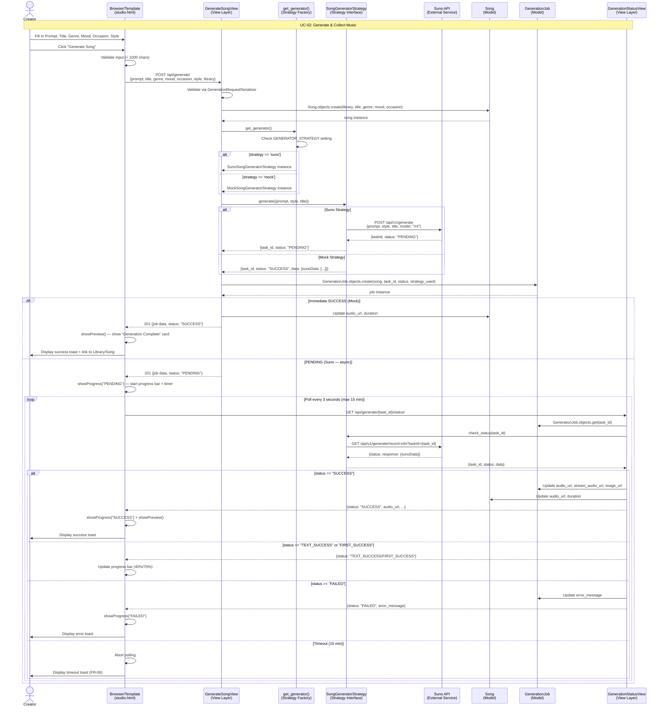

# Sequence Diagram — Song Generation Use Case (UC-02)

## Overview
This document presents the **sequence diagram** for the core "Generate & Collect Music" use case (UC-02) of the Cithara platform. It shows the interaction flow between the Creator, the browser UI (Template), the Django backend (View), the data models, and the external Suno AI API.

## Sequence Diagram

## Actors and Components

| Component | Layer | Description |
|---|---|---|
| Creator | Actor | The authenticated user generating music |
| Browser/Template | Template (MVT) | `studio.html` + `app.js` — handles form, progress bar, polling |
| GenerateSongView | View (MVT) | Handles POST `/api/generate/` — creates Song + delegates to strategy |
| GenerationStatusView | View (MVT) | Handles GET `/api/generate/{task_id}/status/` — polls strategy |
| get_generator() | Strategy Factory | Returns the active strategy based on `GENERATOR_STRATEGY` setting |
| SongGeneratorStrategy | Strategy Interface | Abstract base class defining `generate()` and `check_status()` |
| Suno API | External Service | Third-party AI music generation API |
| Song | Model (MVT) | The core artifact — stores metadata and audio URL |
| GenerationJob | Model (MVT) | Tracks async generation task status and results |

## Key Design Decisions

1. **Strategy Pattern**: The generation logic is decoupled via `SongGeneratorStrategy`. This allows seamless switching between `MockSongGeneratorStrategy` (offline dev) and `SunoSongGeneratorStrategy` (production) via a single environment variable.

2. **Asynchronous Polling**: Since Suno API generation is async (can take minutes), the frontend polls `/api/generate/{task_id}/status/` every 3 seconds with a 15-minute timeout (FR-06).

3. **Progressive Status**: The system tracks 4 status stages: `PENDING` → `TEXT_SUCCESS` → `FIRST_SUCCESS` → `SUCCESS`, providing granular progress feedback to the user.
